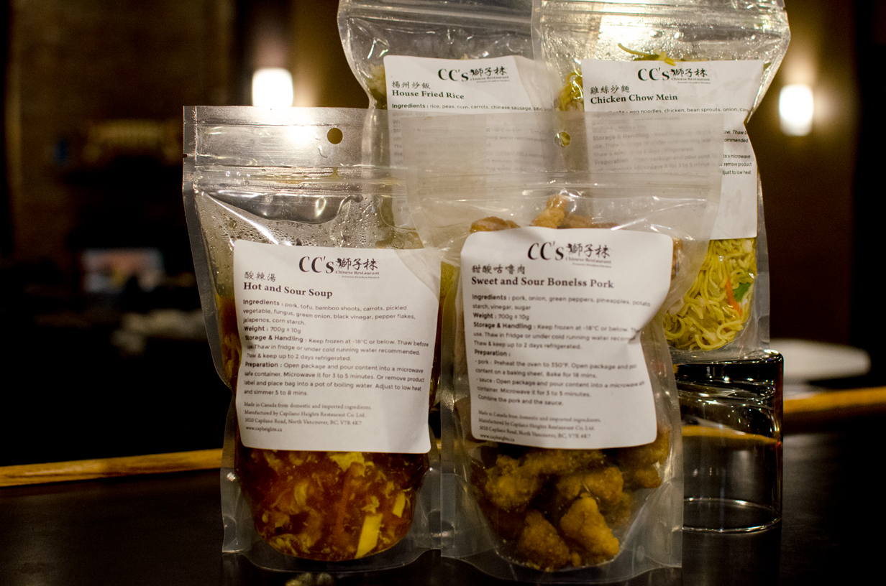
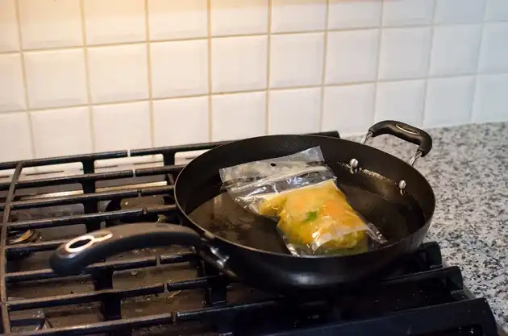
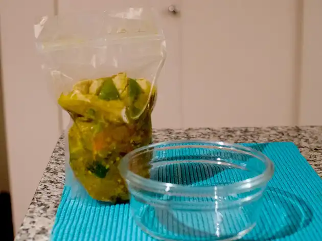
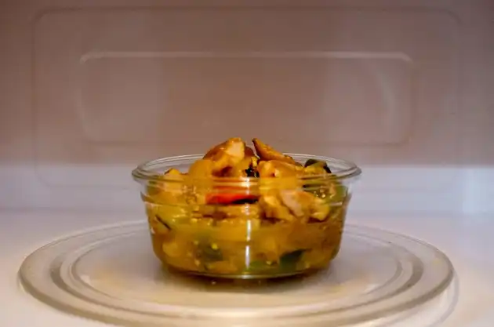
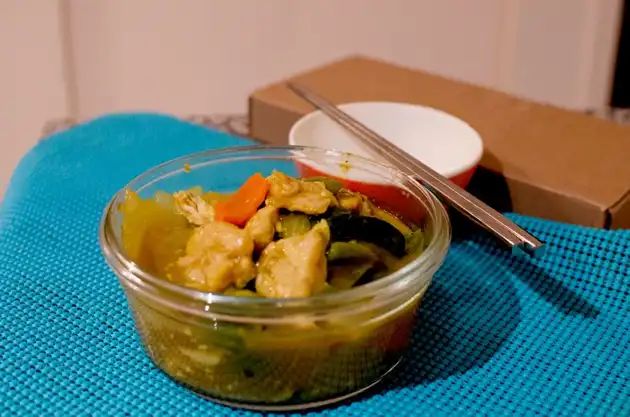

<!--StartFragment-->

🥡 Craving the taste of authentic Chinese cuisine?

We've got you covered with our Ready-Made frozen Chinese food!

🍜 Keep your freezer stocked and satisfy your cravings anytime, anywhere.

No more worries about cooking when you're feeling cozy at home.

Indulge in the flavors of a Chinese restaurant within minutes!

🌟 Let us make your life easier and take care of your meals for you.

Explore our menu options, including Hot and Sour Soup, Chicken Chow Mein, House Fried Rice, and Sweet and Sour Boneless Pork.

🍲🥢 Don't miss out on these delectable additions!

Prices start at just $9.95

Place your order online at

https://ccs-chinese-restaurant-online-order.square.site/

<!--EndFragment-->

    <h4>The At-Home Menu</h4>
    酸辣湯 Hot and Sour Soup $ 9.95
          
    雞絲炒麵 Chicken Chow Mein $ 10.95
             
    揚州炒飯 House Fried Rice $ 11.95
      
    甜酸咕嚕肉 Sweet and Sour Boneless Pork $ 13.95

 

- - -

#### How to prepare your Ready-Made Chinese Food?

* Keep frozen at -18°C or below. 

  * Thaw before use. 
* Thaw in fridge or under cold running water recommended.

  * After thawing keep up to 2 days refrigerated.

- - -

**Stovetop Prepartion:** Remove product label and place bag into a pot of boilng water.  Adjust to low heat and simmer 5 to 8 minutes.

- - -

**Microwave Peparation:** Open pacakge and pour contents into a microwave safe container.  Microwave for 3 to 5 minutes.

- - -

#### Enjoy your meal!

