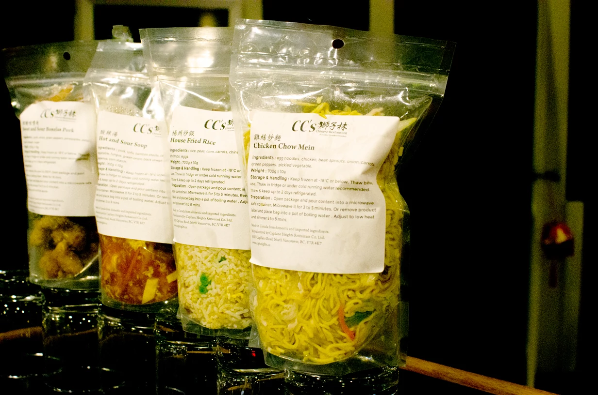
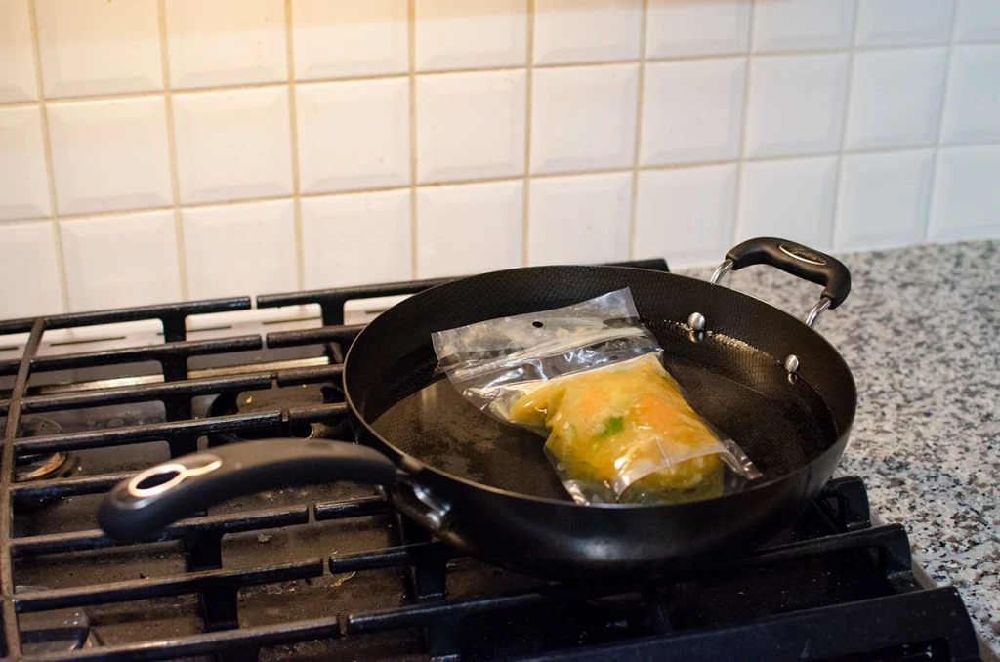
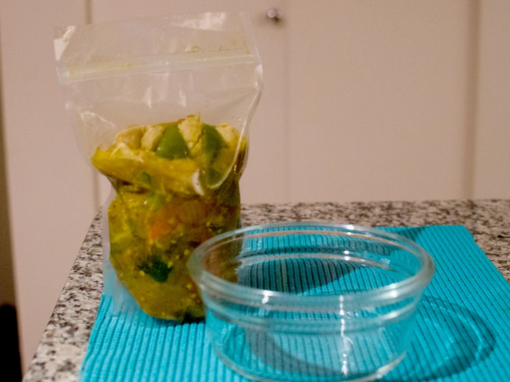
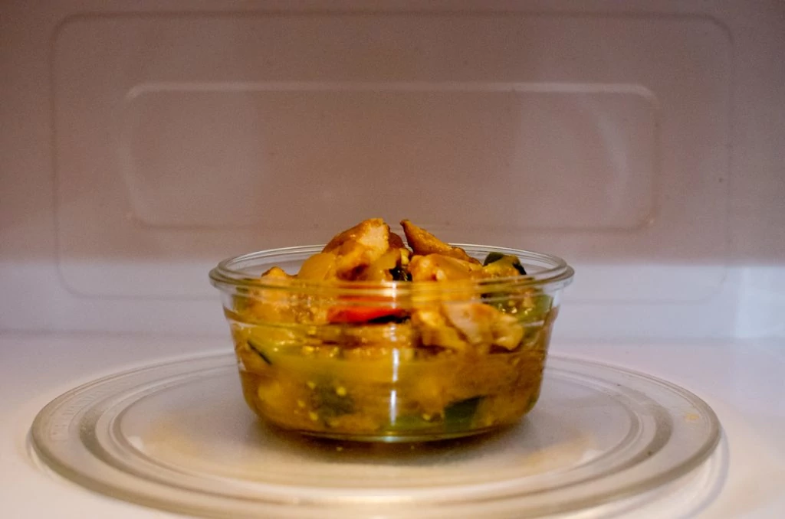
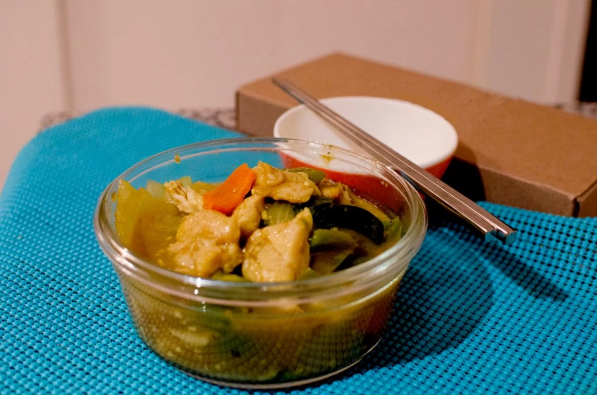

    <h4>CC's and Drunken Monkey Present:</h4>
    <h4>*** Ready-Made Chinese Food ***</h4>
    Keep it fresh in the freezer and enjoy it anytime you want!

 

---

 

We have been working hard to bring an exciting twist on our current menu! Life can be stressful and difficult, but your meals don’t need to be. Come on down to CC’s and let us take care of your meals for you.

Level up your dinner with our newly created At-Home Menu! Now you can finally bring our boldly authentic Chinese entrees and appetizers for a dine-out experience in the comfort of your own home. All of our ingredients are fresh, locally sourced and aimed to bring out the best flavours of Chinese cooking!

    <h4>The At-Home Menu</h4>
    酸辣湯 Hot and Sour Soup $ 8.95
      
    時菜炒麵 Vegetable Chow Mein $ 8.95
          
    雞絲炒麵 Chicken Chow Mein $ 9.95
             
    時菜炒飯 Vegetable Fried Rice $ 8.95
              
    揚州炒飯 House Fried Rice $ 10.95
      
    咖哩雞肉 Creamy Curry Chicken $ 11.95
      
    甜酸咕嚕肉 Sweet and Sour Boneless Pork $ 12.95
      
    More selection coming soon!

 

---
#### How to prepare your Ready-Made Chinese Food?

* Keep frozen at -18°C or below. 
    * Thaw before use. 
* Thaw in fridge or under cold running water recommended.
    * After thawing keep up to 2 days refrigerated.

---
**Stovetop Prepartion:** Remove product label and place bag into a pot of boilng water.  Adjust to low heat and simmer 5 to 8 minutes.

---

**Microwave Peparation:** Open pacakge and pour contents into a microwave safe container.  Microwave for 3 to 5 minutes.

---

#### Enjoy your meal!

