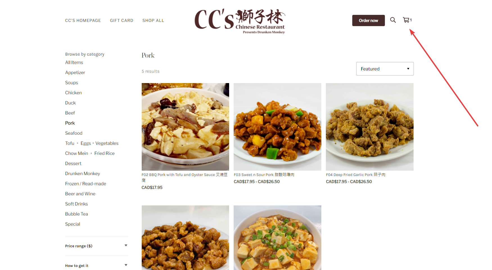
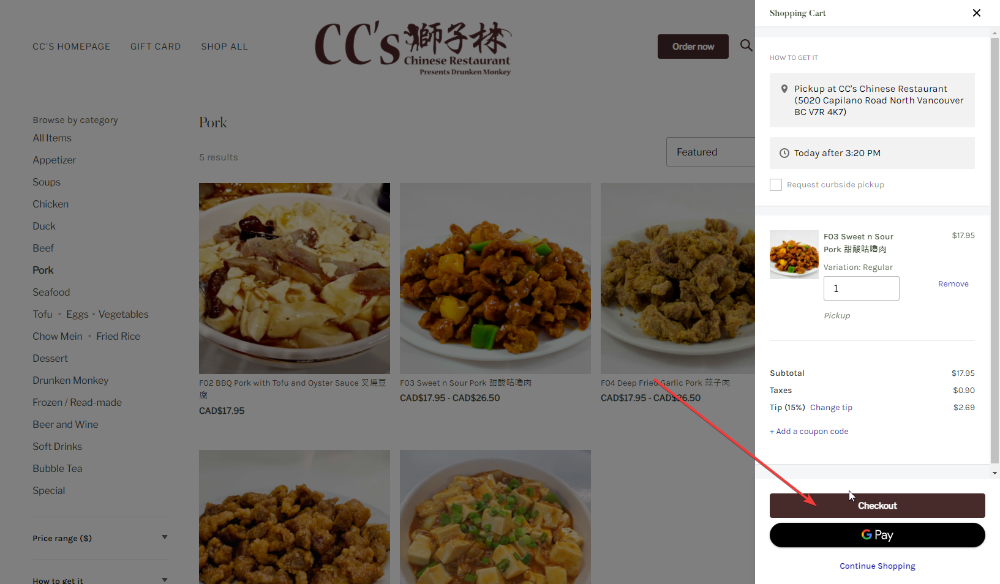
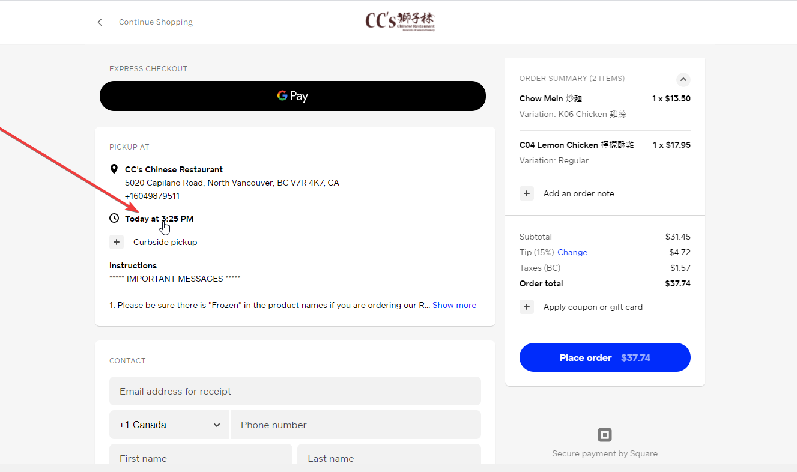
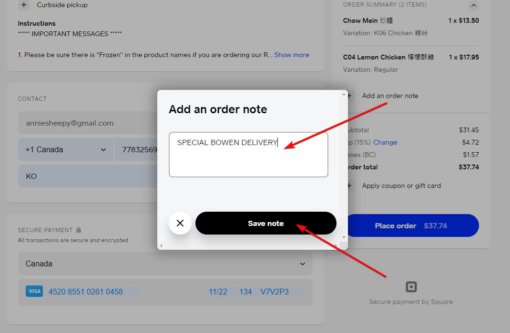
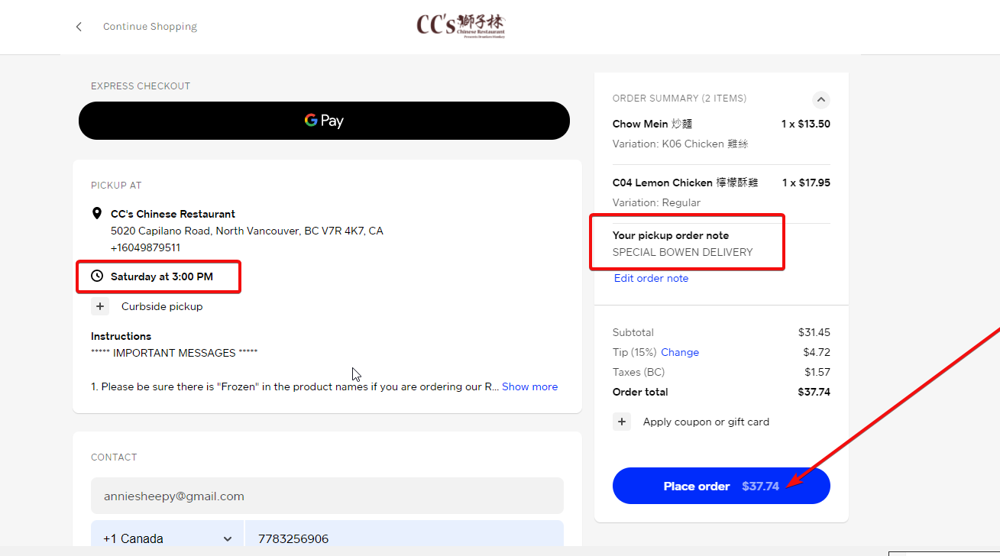

<!--StartFragment-->

<!-- wp:paragraph -->

Welcome to use our online order system! Please click the link below to place your order!

<!-- /wp:paragraph -->

<!-- wp:paragraph -->

**[ONLINE ORDER](https://ccs-chinese-restaurant-online-order.square.site/)**

<!-- /wp:paragraph -->

<!-- wp:paragraph -->

Please take a moment to read this post for instruction on how to leave a note as "SPECIAL BOWEN DELIVERY" for your online order.

<!-- /wp:paragraph -->

<!-- wp:paragraph -->

1. Pick and choose your items on our online store.\
   <https://ccs-chinese-restaurant-online-order.square.site/>

<!-- /wp:paragraph -->

<!-- wp:paragraph -->

2. Click on the shopping cart on the top right.

<!-- /wp:paragraph -->

<!-- wp:image -->

<!-- /wp:image -->

<!-- wp:paragraph -->

 3. Click on “**Checkout**“

<!-- /wp:paragraph -->

<!-- wp:image {"id":28699,"sizeSlug":"large","linkDestination":"none"} -->

<!-- /wp:image -->

<!-- wp:paragraph -->

4. Click on the default pick up time, and a "Change Order Time" window will pop up. Click on "Yes, change time button. "

<!-- /wp:paragraph -->

<!-- wp:image {"id":28700,"sizeSlug":"large","linkDestination":"none"} -->

<!-- /wp:image -->

<!-- wp:paragraph -->

5. Click to choose the date of the delivery and roll down to choose 3pm . Click the  "change (mmm. dd (3:00pm.)" button

, and then click the \"change  (mmm. dd (3:00pm.)\" button.")

6. Fulfill your CONTACT and SECURE PAYMENT information. At the right column under your order items, click on "Add an order note". 

<!-- /wp:paragraph -->

<!-- wp:image {"id":28701,"sizeSlug":"large","linkDestination":"none"} -->

<!-- /wp:image -->

<!--EndFragment-->

7. Leave "**SPECIAL BOWEN DELIVERY**" in the input field and click on "save note" button.

8.  Make sure you've selected the pick up time at 3pm on Saturday and with the "SPECIAL BOWEN DELIVERY" note added. Click on "Place Order" button and you're all set! :)

