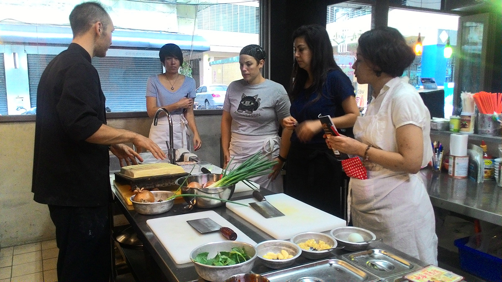

At the Drunken Monkey you will have the opportunity to learn how to cook authentic Chinese food in a fully equipped professional kitchen. We offer classes for students with any level of experience, from complete beginners to seasoned veterans.

>Alex is C.C.’s grandson and he had been working in the restaurant with his grandpa since he was young. It is always his interest to learn and promote the essence of Chinese cooking to the whole world.

Drunken Monkey was opened in Taipei, Taiwan in 2011. At first, it was just a Taiwanese stir fry restaurant. Being English friendly, we’ve received several requests of holding cooking classes for foreigners in Taiwan. And finally, we made it happened.

`youtube: https://youtu.be/aZjd5TTG_7k`
`youtube: https://youtu.be/WeWwl7WanMc`

#### See what students of the Drunken Monkey have to say!

<!-- TODO TripAdvisor -->