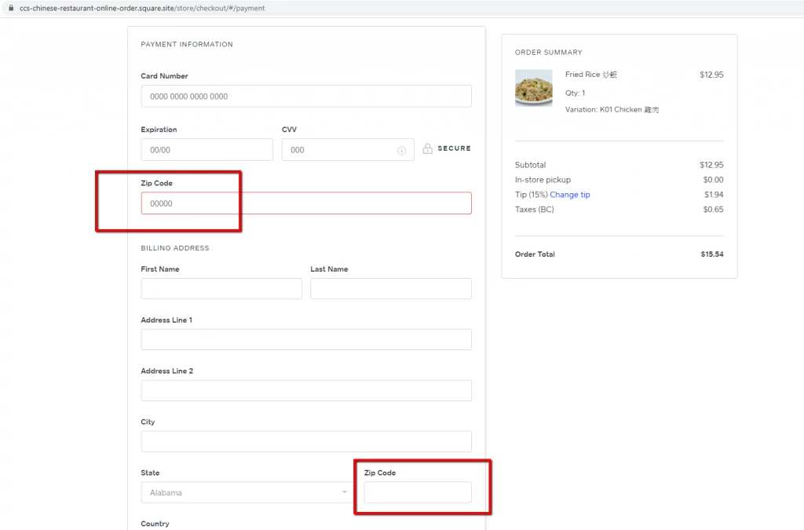
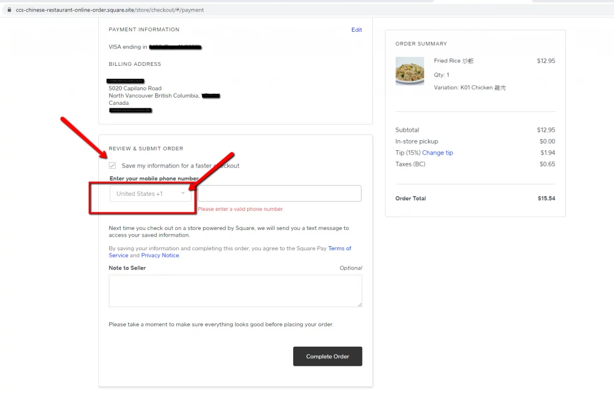
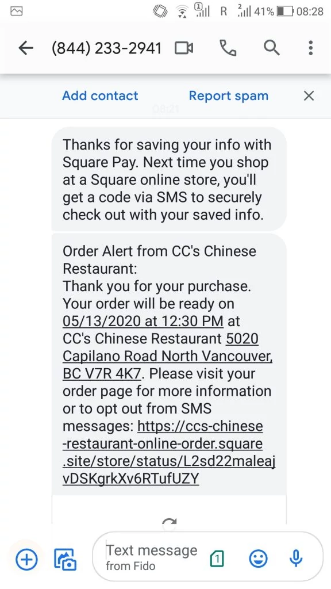
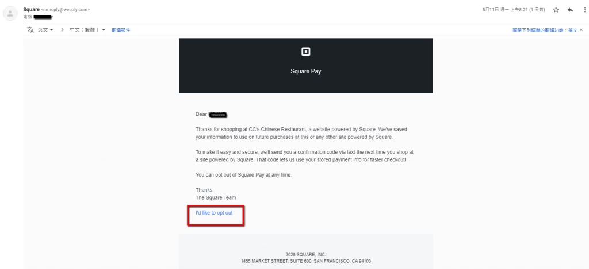
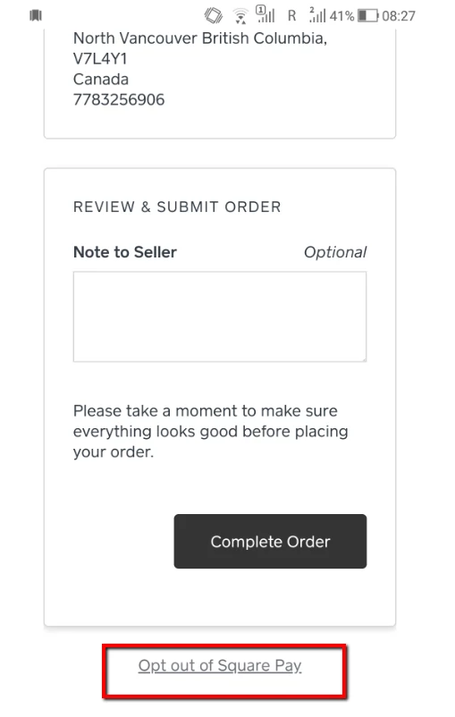

 

Welcome to our online order system!  Please click on the link below to place your order!

<h2><a href="https://ccs-chinese-restaurant-online-order.square.site/">ONLINE ORDER</a></h2>

 

You can place an order through our online order site, pay with credit card, and have CONTACTLESS CURBSIDE pick up in our parking lot!

Just give us a ring at 604-987-9511 when you ge there and we'll bring your order to you.

If you encouter difficulties when using our online ordering system, please take a momemnt to read this post to find helpful information. (Click on the questions below and you'll be taken to the answers!)

[Q: Why can't I get through the checkout process at the last step?](#last-step)

[Q: ZIP CODE ? and POSTAL CODE?](#zip)

[Q: How to opt in the FASTER CHECKOUT feature?](#faster-checkout)

[Q: Why isn’t my faster checkout working?](faster-checkout-broken)

[Q: How to schedule my pick up order for later?](#future-order)

[Q: How to apply coupon code to online order?](#coupon)

#### Q: Why can't I get through the checkout process at the last step? {#last-step}

A : If you’re having difficulty check out at the last step when filling your telephone numbers, please uncheck the box saying “Save my information for a faster checkout”.
And the process will go through.

If you want to make the faster checkout work, please follos [these directions here](#faster-checkout)

\####Q: ZIP CODE ? and POSTAL CODE? {#zip}
A : We are using a third party system, SQUARE, which is a US based company. Therefore you will see quite a few default settings in US standard, such as asking for a ZIP CODE instead of a POSTAL CODE which we use in Canada.

Please just ignore the different term they are using and go head and fill in your POSTAL CODE in the ZIP CODE fields.

Once you’ve set the country field to CANADA, the form title will actually changed to POSTAL CODE automatically.

#### Q : How to opt in the FASTER CHECKOUT feature? {#faster-checkout}

A : When you proceed with the checkout process to the fourth section “REVIEW & SUBMIT ORDER”, check the checkbox before “Save my information for a faster checkout” and remember to set the mobile phone number field to “Canada +1” instead of the default “United State +1” .

After you hit the “Complete Order” button, you’ll immediately receive an SMS message on your mobile phone as well as a confirmation E-mail from Square, both pictured below. Congratulations, you’re all set to go with the faster checkout feature.

 

The next time you make an online purchase, you’ll see a pop-up window like this when you enter your email address.

And you will receive a SMS message in your mobile phone with a 6-digit code.

Simply enter the 6-digit code back in the checkout process and the system will fill out the information needed to complete the order.

You can always opt out this feature with the button shown here in the last step in the checkout process or in the email you received when you opted in.

 

### Q: How to apply coupon code to online order? {#coupon}

1. Pick and choose your items on our online store.

[https://ccs-chinese-​restaurant-online-order.​square.site/](https://ccs-chinese-restaurant-online-order.square.site/) 

2. Click on the shopping cart on the top right.

 3. Click on "[+ Add a coupon code](<>)"

4. Type in the coupon code and click on "Apply"

5. The 20% discount will be applied to the total amount, and proceed to Checkout.

<!--EndFragment-->

###